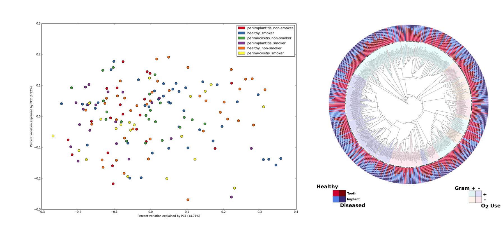

PhyloToAST
===========
.. image:: https://img.shields.io/pypi/v/phylotoast.svg?style=plastic   
    :target: https://pypi.python.org/pypi/phylotoast
    :alt: Latest Version
.. image:: https://img.shields.io/pypi/l/phylotoast.svg?style=plastic   
    :target: https://pypi.python.org/pypi/phylotoast
    :alt: License
.. image:: https://img.shields.io/pypi/format/phylotoast.svg?style=plastic   
    :target: https://pypi.python.org/pypi/phylotoast
    :alt: Download format
.. image:: https://img.shields.io/travis/smdabdoub/phylotoast.svg?style=plastic
    :target: https://travis-ci.org/smdabdoub/phylotoast
    :alt: Travis CI build status
.. image:: https://img.shields.io/badge/install%20with-bioconda-4682b4.svg?style=plastic
   :target: https://bioconda.github.io/recipes/phylotoast/README.html

The PhyloToAST project is a collection of python code and scripts that
modify the QIIME [1] pipeline by adding/changing several
steps including: support for cluster-computing, multiple primer support
(eliminate primer bias) [2], enhanced support for species-specific
analysis, and additional visualization tools.

Installation
------------

To install PhyloToAST from PyPI:

.. code-block:: bash

    $ pip install phylotoast

From source:

.. code-block:: bash

    $ python setup.py install

Documentation
-------------

Full documentation for the scripts and code is available at
`docs.phylotoast.org`_ (hosted by `Read the Docs`_)

Requirements
------------

The list of required modules will vary depending on which executable scripts and/or
parts of the API you may use. For this reason there are no required dependencies
that will be automatically installed along with PhyloToAST. Each executable script will
check that the required libraries are installed and will print a message if any are not
found. 

If you would like to install everything up front, the following is a complete list of libraries
that are used in PhyloToAST:

- `numpy`_
- `scipy`_
- `matplotlib`_ >= 1.5.0
- `biopython`_ >= 1.60 
- `scikit-bio`_
- `scikit-learn`_
- `pandas`_
- `statsmodels`_
- `palettable`_
- `biom-format`_ >= 2.1.5
- `h5py`_ (for parsing BIOM v2.x format files)

Source
------

The `PhyloToAST source`_ is hosted on github.

Citing
------

Dabdoub, S.M. et al., *PhyloToAST: Bioinformatics tools for
species-level analysis and visualization of complex microbial communities*. Scientific Reports, 2016 (Accepted).

Publications using PhyloToAST
------------------------------
Tsigarida and Dabdoub et al., *The Influence of Smoking on the Peri-Implant
Microbiome*. Journal of Dental Research, 2015; `doi: 10.1177/0022034515590581`_

Mason et al., *The subgingival microbiome of clinically healthy current
and never smokers*. The ISME Journal, 2014; `doi:10.1038/ismej.2014.114`_

Dabdoub et al., *Patient-specific Analysis of Periodontal and Peri-implant Microbiomes*.
Journal of Dental Research, 2013; `doi: 10.1177/0022034513504950`_

References
----------

[1] J Gregory Caporaso, et al., *QIIME allows analysis of
high-throughput community sequencing data*. Nature Methods, 2010;
`doi:10.1038/nmeth.f.303`_

[2] Kumar PS, et al., *Target Region Selection Is a Critical Determinant
of Community Fingerprints Generated by 16S Pyrosequencing*. PLoS ONE
(2011) 6(6): e20956. `doi:10.1371/journal.pone.0020956`_

.. _docs.phylotoast.org: http://phylotoast.readthedocs.org
.. _Read the Docs: http://readthedocs.org
.. _numpy: http://numpy.org
.. _scipy: http://scipy.org
.. _matplotlib: http://matplotlib.org
.. _biopython: http://biopython.org
.. _scikit-bio: http://scikit-bio.org
.. _scikit-learn: http://scikit-learn.org
.. _pandas: http://pandas.pydata.org
.. _statsmodels: http://statsmodels.sourceforge.net/
.. _palettable: https://jiffyclub.github.io/palettable/
.. _biom-format: http://biom-format.org
.. _h5py: http://www.h5py.org/
.. _PhyloToAST source: http://github.com/smdabdoub/phylotoast
.. _`doi: 10.1177/0022034515590581`: http://dx.doi.org/10.1177/0022034515590581
.. _`doi:10.1038/ismej.2014.114`: http://dx.doi.org/10.1038/ismej.2014.114
.. _`doi: 10.1177/0022034513504950`: http://dx.doi.org/10.1177/0022034513504950
.. _`doi:10.1038/nmeth.f.303`: http://dx.doi.org/10.1038/nmeth.f.303
.. _`doi:10.1371/journal.pone.0020956`: http://dx.doi.org/10.1371/journal.pone.0020956
