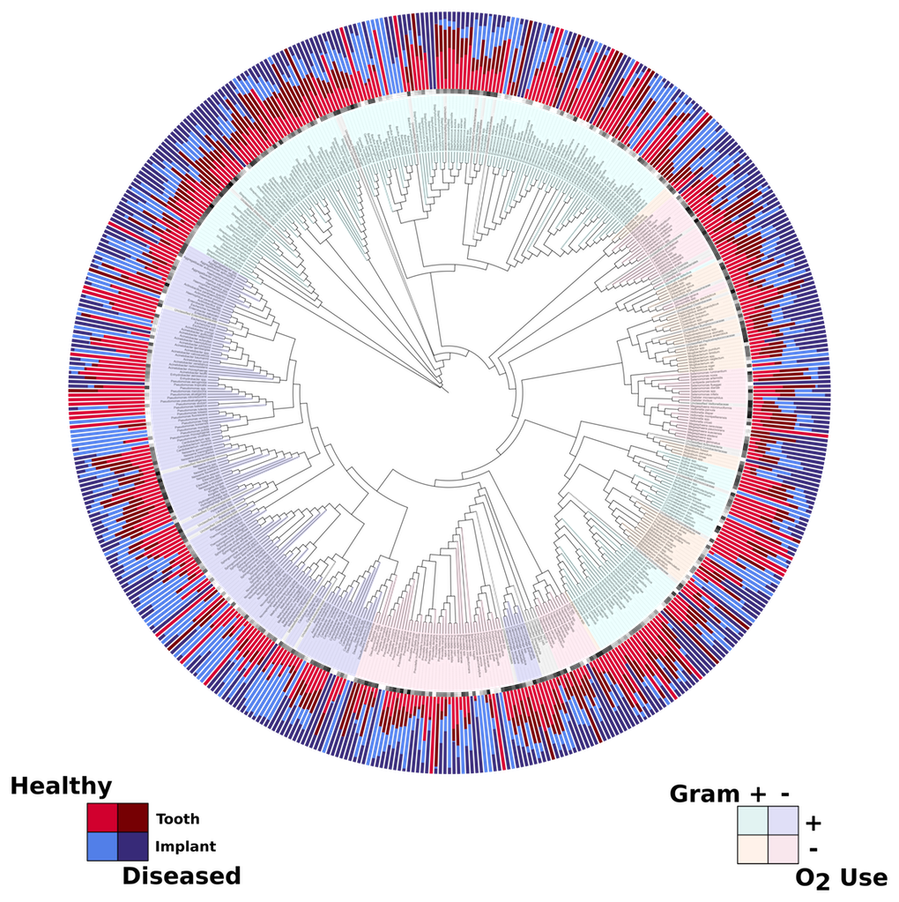
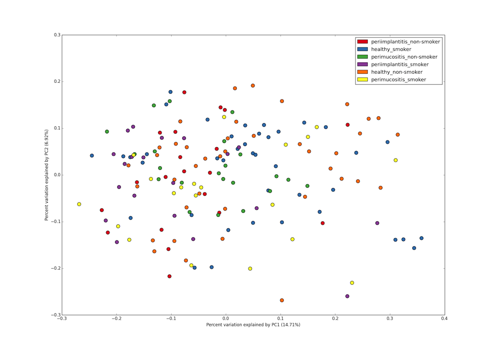

PhyloToAST
===========
.. image:: https://pypip.in/version/qiime-tools/badge.svg
    :target: https://pypi.python.org/pypi/qiime-tools/
    :alt: Latest Version
.. image:: https://pypip.in/d/qiime-tools/badge.svg
    :target: https://crate.io/packages/qiime-tools/
.. image:: https://pypip.in/license/qiime-tools/badge.svg
    :target: https://pypi.python.org/pypi/qiime-tools/
    :alt: License
.. image:: https://pypip.in/format/qiime-tools/badge.svg
    :target: https://pypi.python.org/pypi/qiime-tools/
    :alt: Download format

The PhyloToAST project is a collection of python code and scripts that
modify the original QIIME [1] pipeline by adding/changing several
steps including: support for cluster-computing, multiple primer support
(eliminate primer bias) [2], enhanced support for species-specific
analysis, and additional visualization tools.

Installation
------------

To install PhyloToAST from PyPI:

.. code-block:: bash

    $ pip install qiime-tools

From source:

.. code-block:: bash

    $ python setup.py install

Documentation
-------------

Full documentation for the scripts and code is available at the
`PhyloToAST documentation site`_

Requirements
------------

`matplotlib`_ for PCoA plots. `Biopython`_ for some sequence and fastq
processing, although its use is being phased out. `fuzzpy`_ for the
otu\_calc module. Note that these are not listed as dependencies in the install
script because they are not required for all functionality. Install as needed.

Source
------

The `PhyloToAST source`_ is hosted on github.

Citing
------

A manuscript describing the PhyloToAST software is currently in
preparation. Until publication, please cite the github repository and
the author: Shareef M. Dabdoub.

Publications using PhyloToAST
------------------------------

Mason et al., *The subgingival microbiome of clinically healthy current
and never smokers*. The ISME Journal, 2014; `doi:10.1038/ismej.2014.114`_

Dabdoub et al., *Patient-specific Analysis of Periodontal and Peri-implant Microbiomes*.
Journal of Dental Research, 2013; `doi: 10.1177/0022034513504950`_

References
----------

[1] J Gregory Caporaso, et al., *QIIME allows analysis of
high-throughput community sequencing data*. Nature Methods, 2010;
`doi:10.1038/nmeth.f.303`_

[2] Kumar PS, et al., *Target Region Selection Is a Critical Determinant
of Community Fingerprints Generated by 16S Pyrosequencing*. PLoS ONE
(2011) 6(6): e20956. `doi:10.1371/journal.pone.0020956`_

.. _PhyloToAST documentation site: http://qiime-tools.readthedocs.org
.. _matplotlib: http://matplotlib.org
.. _Biopython: http://biopython.org
.. _fuzzpy: http://mavrinac.com/index.cgi?page=fuzzpy
.. _PhyloToAST source: http://github.com/smdabdoub/phylotoast
.. _`doi:10.1038/ismej.2014.114`: http://dx.doi.org/10.1038/ismej.2014.114
.. _`doi: 10.1177/0022034513504950`: http://dx.doi.org/10.1177/0022034513504950
.. _`doi:10.1038/nmeth.f.303`: http://dx.doi.org/10.1038/nmeth.f.303
.. _`doi:10.1371/journal.pone.0020956`: http://dx.doi.org/10.1371/journal.pone.0020956
